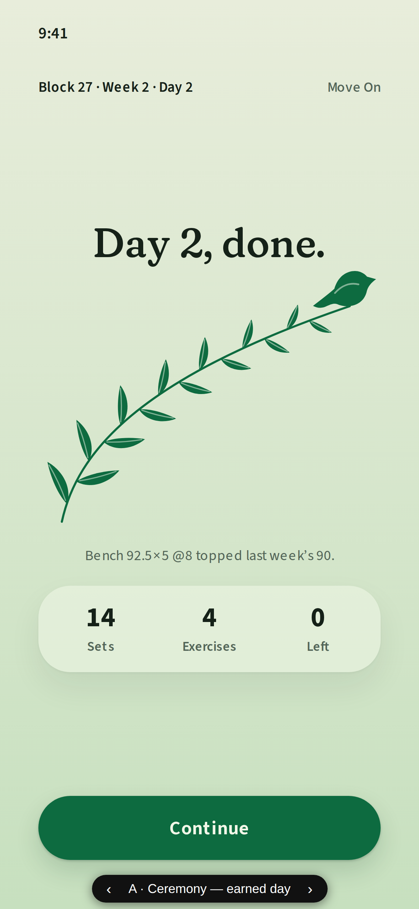
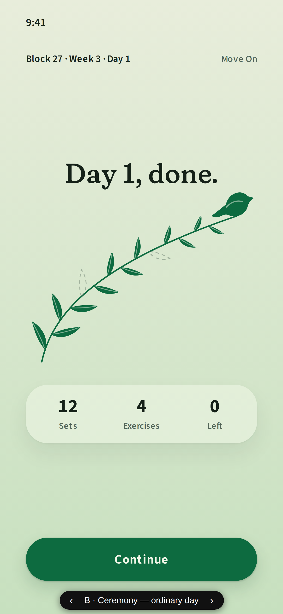
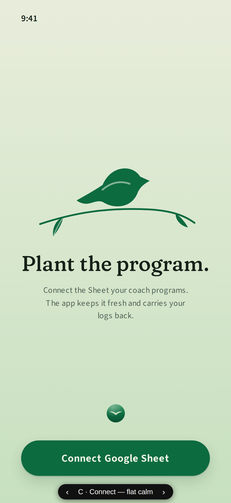
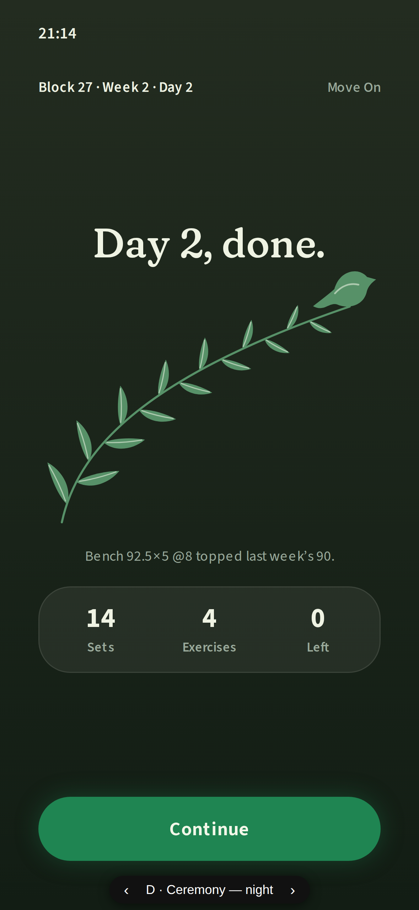
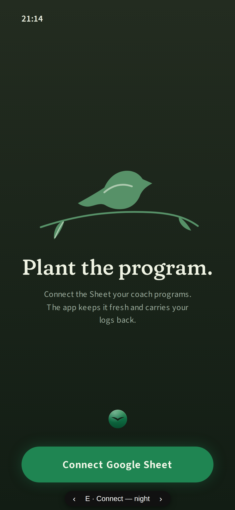

# Sunbird moments — the Two Perches in the final language (#414)

Throwaway prototype renders for [issue #414](https://github.com/Sunnshiine/workout-app/issues/414).
The switchable prototype is `sunbird-moments.html` (`?variant=a|b|c|d|e`); rebuild via
`python3 build-sunbird-moments.py` after editing the template.

## A · Ceremony — earned day

## B · Ceremony — ordinary day (the curdle test)

## C · Connect — flat calm

## D · Ceremony — night

## E · Connect — night

